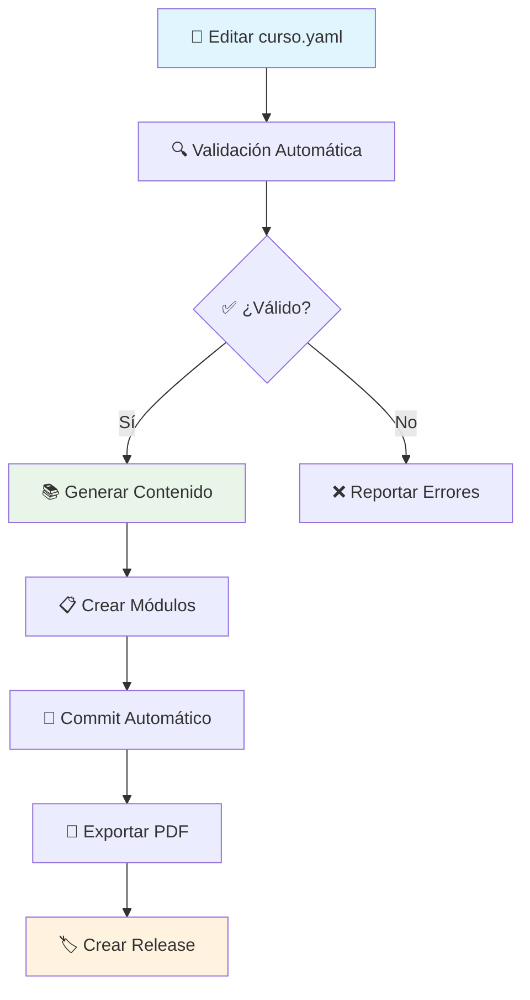

# 🎓 Sistema Automatizado de Generación de Cursos

> **Un framework completo para la creación, validación y distribución automatizada de cursos educativos usando GitHub Actions**

[](https://github.com/tu-usuario/teach-laoz-courses/actions/workflows/generate-course.yml)
[](https://github.com/tu-usuario/teach-laoz-courses/actions/workflows/validate-simple.yml)
[](https://github.com/tu-usuario/teach-laoz-courses/actions/workflows/export-pdf.yml)

## 🌟 Características Principales

- **🤖 Automatización Completa**: Generación automática de contenido a partir de archivos YAML
- **✅ Validación Continua**: Verificación automática de estructura y contenido
- **📄 Exportación Inteligente**: Conversión automática a PDF con formato profesional
- **🔄 CI/CD Integrado**: Workflows de GitHub Actions para todo el ciclo de vida
- **📊 Métricas y Reportes**: Estadísticas automáticas y reportes de validación
- **🎨 Templates Reutilizables**: Plantillas base para crear nuevos cursos rápidamente

## 🚀 Inicio Rápido

### 1. Crear un Nuevo Curso

```bash
# 1. Copiar template base
cp template-curso.yaml mi-nuevo-curso/curso.yaml

# 2. Configurar scripts
mkdir -p mi-nuevo-curso/scripts
cp curso-IA-AUTOMATIZACION/scripts/* mi-nuevo-curso/scripts/

# 3. Editar configuración del curso
# Editar mi-nuevo-curso/curso.yaml con tu contenido

# 4. Generar contenido
cd mi-nuevo-curso
python scripts/generate_course.py curso.yaml
```

### 2. Usar la Utilidad de Automatización

```bash
# Ver estado del curso
python course-automation.py --dir mi-nuevo-curso status

# Validar estructura
python course-automation.py --dir mi-nuevo-curso validate

# Generar contenido completo
python course-automation.py --dir mi-nuevo-curso generate

# Proceso completo (validar + generar + exportar)
python course-automation.py --dir mi-nuevo-curso build
```

### 3. Automatización con GitHub Actions

**Generación Automática**: Se ejecuta automáticamente cuando modificas archivos `curso.yaml`

**Ejecución Manual**:
1. Ve a Actions → "🚀 Generación Automática de Cursos"
2. Click en "Run workflow"
3. Especifica la ruta: `mi-nuevo-curso/curso.yaml`

**Exportación a PDF**:
1. Ve a Actions → "📄 Exportar Cursos a PDF"
2. Click en "Run workflow"
3. Especifica el directorio: `mi-nuevo-curso`

## 📋 Estructura del Proyecto

```
📁 teach-laoz-courses/
├── 🤖 .github/workflows/           # Automatización CI/CD
│   ├── generate-course.yml         # Generación automática
│   ├── validate-simple.yml         # Validación continua
│   └── export-pdf.yml              # Exportación a PDF
├── 📚 curso-IA-AUTOMATIZACION/     # Curso de ejemplo
│   ├── curso.yaml                  # Configuración del curso
│   ├── scripts/                    # Scripts de automatización
│   ├── README.md                   # Documentación generada
│   ├── roadmap.md                  # Hoja de ruta
│   ├── modulos/                    # Módulos del curso
│   └── exports/pdf/                # PDFs generados
├── 📄 template-curso.yaml          # Template base
├── 🔧 course-automation.py         # Utilidad CLI
└── 📖 AUTOMATION-GUIDE.md          # Guía completa
```

## 🎯 Flujo de Trabajo Automatizado



## 📚 Cursos Disponibles

### 🤖 IA y Automatización de Procesos
- **ID**: `AI-AUTO-001`
- **Nivel**: Fundamentos  
- **Duración**: 10 horas
- **Estado**: ✅ Completo
- **[📖 Ver Curso](curso-IA-AUTOMATIZACION/README.md)** | **[📄 Descargar PDF](https://github.com/tu-usuario/teach-laoz-courses/releases)**

## 🛠️ Scripts y Herramientas

### Scripts por Curso
- **`generate_course.py`**: Genera todo el contenido del curso
- **`validate_yaml.py`**: Valida estructura y contenido YAML
- **`export_pdf.sh`**: Exporta contenido a PDF

### Utilidad Global
- **`course-automation.py`**: CLI unificada para todas las operaciones

### Workflows de GitHub Actions
- **Generación Automática**: Detecta cambios y regenera contenido
- **Validación Continua**: Verifica integridad de todos los cursos
- **Exportación PDF**: Convierte contenido a formato PDF profesional

## 📊 Características del Sistema

### ✅ Validación Inteligente
- Verificación de estructura YAML
- Validación de campos requeridos
- Comprobación de consistencia entre módulos
- Verificación de pesos de evaluación

### 📚 Generación Automática
- README principal con información completa
- Roadmap detallado con diagramas Mermaid
- Estructura de módulos con plantillas
- Archivos de test y validación

### 📄 Exportación Profesional
- Conversión a PDF con LaTeX
- Formato consistente y profesional
- PDF combinado del curso completo
- Archivos individuales por sección

### 🔄 Integración CI/CD
- Triggers automáticos en cambios
- Ejecución manual cuando sea necesario
- Reportes detallados de cada ejecución
- Artifacts y releases automáticos

## 🎨 Personalización

### Templates
El sistema usa templates personalizables en:
- `template-curso.yaml`: Estructura base de cursos
- Scripts de generación con lógica modificable
- Workflows de GitHub Actions configurables

### Configuración
Variables configurables:
- Formato de salida (Markdown, PDF, HTML)
- Nivel de validación (básico, estricto)
- Estructura de módulos personalizable
- Temas y estilos de exportación

## 📈 Métricas y Monitoreo

El sistema genera automáticamente:
- **Estadísticas de curso**: Módulos, laboratorios, evaluaciones
- **Métricas de validación**: Tasa de éxito, errores comunes
- **Reportes de exportación**: Archivos generados, tamaños
- **Logs detallados**: Trazabilidad completa de cada operación

## 🔧 Instalación y Configuración

### Prerequisitos
```bash
# Python 3.8+
python --version

# Dependencias Python
pip install pyyaml

# Para exportación PDF (opcional)
# Ubuntu/Debian:
sudo apt-get install pandoc texlive-xetex

# Windows: Descargar desde https://pandoc.org/
# macOS: brew install pandoc basictex
```

### Configuración del Repositorio
1. **Fork este repositorio**
2. **Actualizar badges** en README con tu usuario/repo
3. **Configurar GitHub Actions** (debería funcionar automáticamente)
4. **Probar con el curso de ejemplo**

## 🤝 Contribución

¡Las contribuciones son bienvenidas! Por favor:

1. **Fork** el proyecto
2. **Crea** una rama para tu feature (`git checkout -b feature/AmazingFeature`)
3. **Commit** tus cambios (`git commit -m 'Add some AmazingFeature'`)
4. **Push** a la rama (`git push origin feature/AmazingFeature`)
5. **Abre** un Pull Request

### Areas de Mejora
- [ ] 🌐 Exportación a HTML interactivo
- [ ] 📱 Responsive design para móviles
- [ ] 🎨 Más templates y temas
- [ ] 🔗 Integración con plataformas LMS
- [ ] 🌍 Soporte multi-idioma
- [ ] 📊 Dashboard web de métricas

## 📄 Licencia

Este proyecto está bajo la Licencia MIT. Ver `LICENSE` para más detalles.

## 👨‍💻 Autor

**Andrés Olarte**
- GitHub: [@tu-usuario](https://github.com/tu-usuario)
- LinkedIn: [Tu perfil](https://linkedin.com/in/tu-perfil)

## 🙏 Agradecimientos

- GitHub Actions por la plataforma de automatización
- Pandoc por las capacidades de conversión de documentos
- Python YAML por el procesamiento de configuraciones
- La comunidad open source por las herramientas y inspiración

---

**⭐ Si este proyecto te ayuda, considera darle una estrella en GitHub!**

*Generado automáticamente con ❤️ usando GitHub Actions*