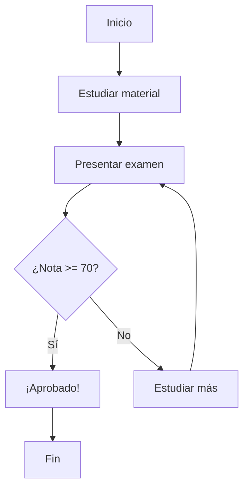
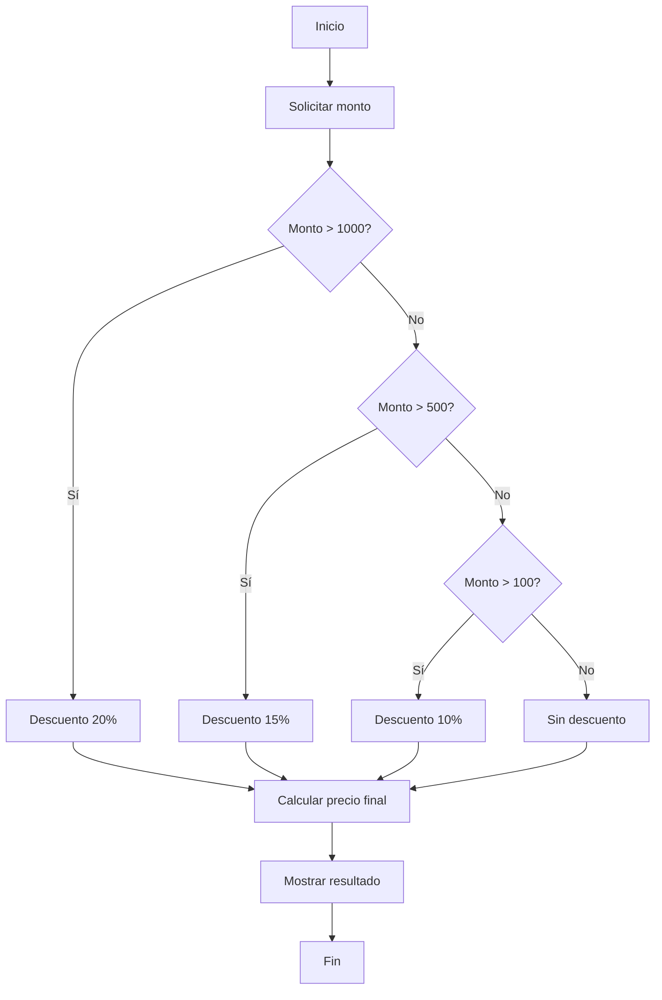

# 02. Lógica y Algoritmos

## 🎯 Objetivos de Aprendizaje

Al finalizar esta unidad, podrás:

- Desarrollar pensamiento computacional estructurado
- Crear algoritmos eficientes para resolver problemas
- Aplicar estructuras de control básicas
- Utilizar diagramas de flujo para visualizar lógica
- Resolver problemas complejos dividiéndolos en partes simples

## 🧩 Pensamiento Computacional

### ¿Qué es el Pensamiento Computacional?

Es la habilidad de **descomponer problemas complejos** en partes más pequeñas y manejables, siguiendo un enfoque lógico y sistemático.

### Los 4 Pilares

1. **Descomposición**: Dividir problemas grandes en pequeños
2. **Reconocimiento de patrones**: Identificar similitudes
3. **Abstracción**: Enfocarse en lo esencial
4. **Algoritmos**: Crear pasos para resolver el problema

### Ejemplo Práctico: Preparar una Cena

**Problema**: Preparar cena para 6 personas

**Descomposición**:
- Planificar menú
- Comprar ingredientes
- Preparar cada plato
- Coordinar tiempos de cocción

**Patrones**:
- Todos los platos necesitan preparación previa
- Algunos pueden cocinarse simultáneamente

**Abstracción**:
- No importa el tipo específico de verdura, sino el tiempo de cocción
- El proceso es similar para diferentes recetas

**Algoritmo**:
```python
def preparar_cena(invitados, menu):
    # 1. Planificación
    calcular_cantidades(invitados, menu)
    
    # 2. Compras
    lista_compras = generar_lista_compras(menu)
    comprar_ingredientes(lista_compras)
    
    # 3. Preparación
    for plato in menu:
        preparar_ingredientes(plato)
        cocinar(plato)
    
    # 4. Servir
    servir_cena()
```

## 📊 Diagramas de Flujo

### Símbolos Básicos

- **Óvalo**: Inicio/Fin
- **Rectángulo**: Proceso/Acción
- **Rombo**: Decisión
- **Círculo**: Conector
- **Flecha**: Flujo de control

### Ejemplo: Algoritmo para Aprobar un Examen



## 🔄 Estructuras de Control

### 1. Secuencial

Las instrucciones se ejecutan una tras otra.

```python
# Ejemplo: Calcular área de un círculo
import math

print("Calculadora de área de círculo")
radio = float(input("Ingresa el radio: "))
area = math.pi * radio ** 2
print(f"El área es: {area:.2f}")
```

### 2. Condicional (if/else)

Permite tomar decisiones basadas en condiciones.

```python
# Ejemplo: Sistema de calificaciones
def evaluar_nota(nota):
    if nota >= 90:
        return "Excelente"
    elif nota >= 80:
        return "Muy bueno"
    elif nota >= 70:
        return "Bueno"
    elif nota >= 60:
        return "Regular"
    else:
        return "Necesita mejorar"

# Uso
nota_estudiante = 85
resultado = evaluar_nota(nota_estudiante)
print(f"Con {nota_estudiante} puntos: {resultado}")
```

### 3. Repetitiva (bucles)

Permite repetir acciones múltiples veces.

#### Bucle `for` (repeticiones conocidas)

```python
# Ejemplo: Tabla de multiplicar
numero = int(input("¿Qué tabla quieres? "))

print(f"Tabla del {numero}:")
for i in range(1, 11):
    resultado = numero * i
    print(f"{numero} x {i} = {resultado}")
```

#### Bucle `while` (repeticiones condicionales)

```python
# Ejemplo: Juego de adivinanza
import random

numero_secreto = random.randint(1, 100)
intentos = 0
adivinado = False

print("¡Adivina el número entre 1 y 100!")

while not adivinado:
    intento = int(input("Tu número: "))
    intentos += 1
    
    if intento == numero_secreto:
        adivinado = True
        print(f"¡Correcto! Lo lograste en {intentos} intentos")
    elif intento < numero_secreto:
        print("Muy bajo, intenta con un número mayor")
    else:
        print("Muy alto, intenta con un número menor")
```

## 🧮 Algoritmos Fundamentales

### 1. Búsqueda Lineal

Buscar un elemento recorriendo la lista uno por uno.

```python
def busqueda_lineal(lista, elemento):
    """
    Busca un elemento en una lista.
    Retorna el índice si lo encuentra, -1 si no.
    """
    for i in range(len(lista)):
        if lista[i] == elemento:
            return i
    return -1

# Ejemplo de uso
numeros = [3, 7, 1, 9, 4, 6, 8]
buscar = 9

posicion = busqueda_lineal(numeros, buscar)
if posicion != -1:
    print(f"Elemento {buscar} encontrado en posición {posicion}")
else:
    print(f"Elemento {buscar} no encontrado")
```

### 2. Ordenamiento Burbuja

Algoritmo simple para ordenar una lista.

```python
def ordenamiento_burbuja(lista):
    """
    Ordena una lista usando el método burbuja.
    Modifica la lista original.
    """
    n = len(lista)
    
    # Recorrer todos los elementos
    for i in range(n):
        # Últimos i elementos ya están ordenados
        for j in range(0, n - i - 1):
            # Intercambiar si están en orden incorrecto
            if lista[j] > lista[j + 1]:
                lista[j], lista[j + 1] = lista[j + 1], lista[j]

# Ejemplo de uso
numeros = [64, 34, 25, 12, 22, 11, 90]
print(f"Lista original: {numeros}")

ordenamiento_burbuja(numeros)
print(f"Lista ordenada: {numeros}")
```

### 3. Algoritmo de Fibonacci

Secuencia matemática famosa: cada número es la suma de los dos anteriores.

```python
def fibonacci_iterativo(n):
    """Calcula el n-ésimo número de Fibonacci iterativamente."""
    if n <= 1:
        return n
    
    a, b = 0, 1
    for _ in range(2, n + 1):
        a, b = b, a + b
    
    return b

def fibonacci_recursivo(n):
    """Calcula el n-ésimo número de Fibonacci recursivamente."""
    if n <= 1:
        return n
    return fibonacci_recursivo(n - 1) + fibonacci_recursivo(n - 2)

# Comparación de métodos
n = 10
print(f"Fibonacci({n}) iterativo: {fibonacci_iterativo(n)}")
print(f"Fibonacci({n}) recursivo: {fibonacci_recursivo(n)}")

# Secuencia completa
print("Primeros 10 números de Fibonacci:")
for i in range(10):
    print(f"F({i}) = {fibonacci_iterativo(i)}")
```

## 🎯 Resolución de Problemas Paso a Paso

### Metodología de 5 Pasos

1. **Entender el problema**: ¿Qué necesito resolver?
2. **Planificar**: ¿Cómo lo voy a resolver?
3. **Implementar**: Escribir el código
4. **Probar**: ¿Funciona correctamente?
5. **Optimizar**: ¿Puedo mejorarlo?

### Ejemplo Completo: Calculadora de Descuentos

**Problema**: Crear una calculadora que aplique descuentos según el monto de compra.

#### Paso 1: Entender
- Input: Monto de compra
- Output: Precio final con descuento
- Reglas: 
  - $0-$100: Sin descuento
  - $101-$500: 10% descuento
  - $501-$1000: 15% descuento
  - $1000+: 20% descuento

#### Paso 2: Planificar



#### Paso 3: Implementar

```python
def calculadora_descuentos():
    """Calculadora de descuentos por monto de compra."""
    
    print("=== CALCULADORA DE DESCUENTOS ===")
    
    # Solicitar monto
    try:
        monto = float(input("Ingrese el monto de compra: $"))
        
        if monto < 0:
            print("Error: El monto no puede ser negativo")
            return
        
        # Determinar descuento
        if monto > 1000:
            descuento = 0.20
            nivel = "Premium (20%)"
        elif monto > 500:
            descuento = 0.15
            nivel = "Gold (15%)"
        elif monto > 100:
            descuento = 0.10
            nivel = "Silver (10%)"
        else:
            descuento = 0.0
            nivel = "Sin descuento"
        
        # Calcular precio final
        monto_descuento = monto * descuento
        precio_final = monto - monto_descuento
        
        # Mostrar resultados
        print(f"\n--- RESUMEN DE COMPRA ---")
        print(f"Monto original: ${monto:.2f}")
        print(f"Nivel de descuento: {nivel}")
        print(f"Descuento aplicado: ${monto_descuento:.2f}")
        print(f"Precio final: ${precio_final:.2f}")
        print(f"Ahorro: ${monto_descuento:.2f}")
        
    except ValueError:
        print("Error: Ingrese un número válido")

# Ejecutar calculadora
calculadora_descuentos()
```

#### Paso 4: Probar

```python
# Casos de prueba
def test_calculadora():
    test_cases = [
        (50, 0, 50),      # Sin descuento
        (150, 15, 135),   # 10% descuento
        (750, 112.5, 637.5),  # 15% descuento
        (1500, 300, 1200)     # 20% descuento
    ]
    
    for monto, descuento_esperado, final_esperado in test_cases:
        # Lógica de cálculo (extraída de la función principal)
        if monto > 1000:
            descuento = monto * 0.20
        elif monto > 500:
            descuento = monto * 0.15
        elif monto > 100:
            descuento = monto * 0.10
        else:
            descuento = 0.0
        
        precio_final = monto - descuento
        
        print(f"Monto: ${monto} -> Descuento: ${descuento} -> Final: ${precio_final}")
        assert descuento == descuento_esperado, f"Error en descuento para monto ${monto}"
        assert precio_final == final_esperado, f"Error en precio final para monto ${monto}"
    
    print("✅ Todos los tests pasaron!")

# Ejecutar tests
test_calculadora()
```

## 💡 Consejos para Crear Algoritmos Eficientes

### 1. Claridad antes que Complejidad

```python
# ❌ Código complejo y difícil de entender
def check(x): return x>0 and x%2==0 and x<100

# ✅ Código claro y legible
def es_numero_par_positivo_menor_que_100(numero):
    es_positivo = numero > 0
    es_par = numero % 2 == 0
    es_menor_que_100 = numero < 100
    
    return es_positivo and es_par and es_menor_que_100
```

### 2. Evitar Repetición de Código (DRY - Don't Repeat Yourself)

```python
# ❌ Código repetitivo
def calcular_area_rectangulo1():
    largo = float(input("Largo: "))
    ancho = float(input("Ancho: "))
    return largo * ancho

def calcular_area_rectangulo2():
    largo = float(input("Largo: "))
    ancho = float(input("Ancho: "))
    return largo * ancho

# ✅ Código reutilizable
def obtener_medidas():
    largo = float(input("Largo: "))
    ancho = float(input("Ancho: "))
    return largo, ancho

def calcular_area_rectangulo(largo, ancho):
    return largo * ancho

# Uso
largo, ancho = obtener_medidas()
area = calcular_area_rectangulo(largo, ancho)
```

### 3. Manejar Errores

```python
def division_segura(a, b):
    """División que maneja el error de división por cero."""
    try:
        resultado = a / b
        return resultado, None  # resultado, error
    except ZeroDivisionError:
        return None, "Error: División por cero no permitida"
    except TypeError:
        return None, "Error: Los valores deben ser números"

# Uso
resultado, error = division_segura(10, 2)
if error:
    print(error)
else:
    print(f"Resultado: {resultado}")
```

## 📝 Ejercicios Prácticos

### Ejercicio 1: Detector de Números Primos

Crea una función que determine si un número es primo.

```python
def es_primo(n):
    """
    Determina si un número es primo.
    Un número primo solo es divisible por 1 y por sí mismo.
    """
    # Tu código aquí
    pass

# Tests
assert es_primo(2) == True
assert es_primo(4) == False
assert es_primo(17) == True
assert es_primo(25) == False
```

### Ejercicio 2: Conversor de Temperatura

Crea un programa que convierta entre Celsius, Fahrenheit y Kelvin.

```python
def conversor_temperatura():
    """
    Programa interactivo para convertir temperaturas.
    """
    # Tu código aquí
    pass
```

### Ejercicio 3: Validador de Contraseñas

Crea una función que valide si una contraseña cumple ciertos criterios.

```python
def validar_contraseña(contraseña):
    """
    Valida que una contraseña cumpla con:
    - Al menos 8 caracteres
    - Al menos una mayúscula
    - Al menos una minúscula
    - Al menos un número
    - Al menos un símbolo especial
    """
    # Tu código aquí
    pass
```

## 🎯 Puntos Clave

- ✅ El pensamiento computacional es fundamental para programar
- ✅ Los diagramas de flujo ayudan a visualizar la lógica
- ✅ Las estructuras de control permiten crear programas dinámicos
- ✅ Los algoritmos básicos son bloques de construcción importantes
- ✅ La práctica constante mejora la habilidad de resolución de problemas

## 🚀 Siguiente Paso

En la siguiente unidad aprenderemos sobre **Python Básico**, donde aplicaremos estos conceptos de lógica usando la sintaxis específica de Python.

---

### 📚 Recursos Adicionales

- [Visualizing Algorithms](https://visualgo.net/)
- [Python Tutor](http://pythontutor.com/)
- [Algorithm Visualizer](https://algorithm-visualizer.org/)