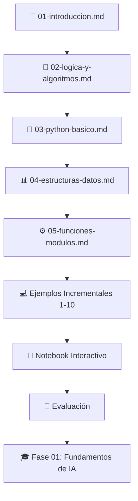

# Fase 00: Fundamentos de Programación

## 🎯 Objetivos de Aprendizaje

Al finalizar esta fase inicial, el estudiante será capaz de:

- Dominar los conceptos básicos de programación en Python
- Configurar un entorno de desarrollo profesional
- Aplicar estructuras de datos y algoritmos fundamentales
- Implementar lógica de programación y resolución de problemas
- Prepararse para el aprendizaje de IA y automatización

## 📋 Contenidos

### 📝 Materiales de Estudio

- [01-introduccion.md](./01-introduccion.md) - Introducción a la programación
- [02-logica-y-algoritmos.md](./02-logica-y-algoritmos.md) - Lógica computacional
- [03-python-basico.md](./03-python-basico.md) - Sintaxis y fundamentos
- [04-estructuras-datos.md](./04-estructuras-datos.md) - Listas, diccionarios, etc.
- [05-funciones-modulos.md](./05-funciones-modulos.md) - Modularización del código

### 💻 Recursos Interactivos

- [notebooks/](./notebooks/) - Ejercicios interactivos y práctica guiada
  - [fase00-fundamentos-python.ipynb](./notebooks/fase00-fundamentos-python.ipynb) - Notebook completo con 6 secciones prácticas
- [ejemplos/](./ejemplos/) - Códigos de referencia y progresión incremental
  - [README.md](./ejemplos/README.md) - Guía de la progresión incremental
  - [INDICE.md](./ejemplos/INDICE.md) - Mapa de ruta de aprendizaje
  - 10 ejemplos progresivos (del básico al avanzado)
- [recursos/](./recursos/) - Documentación adicional y materiales de apoyo

### 🧪 Sistema de Evaluación

- [evaluacion/](./evaluacion/) - Sistema completo de assessment
  - [README.md](./evaluacion/README.md) - Guía del sistema de evaluación
  - [test.md](./evaluacion/test.md) - Test teórico completo (100 puntos)
  - [test_ejecutable.py](./evaluacion/test_ejecutable.py) - Test práctico con evaluación automática
  - [test_soluciones.md](./evaluacion/test_soluciones.md) - Soluciones y rúbrica para instructores

## ⏱️ Duración Estimada

**Tiempo total:** 20-25 horas

- **Teoría:** 8-10 horas (5 archivos de contenido)
- **Práctica:** 10-12 horas (10 ejemplos incrementales + notebook interactivo)
- **Evaluación:** 2-3 horas (test + revisión)

### 📅 Cronograma Sugerido

| Día | Actividad | Tiempo | Recursos |
|-----|-----------|---------|----------|
| 1-2 | Introducción y Lógica | 4h | `01-introduccion.md`, `02-logica-y-algoritmos.md` |
| 3-4 | Python Básico | 4h | `03-python-basico.md`, ejemplos 1-4 |
| 5-6 | Estructuras de Control | 4h | ejemplos 5-6, notebook secciones 1-4 |
| 7-8 | Estructuras de Datos | 4h | `04-estructuras-datos.md`, ejemplos 7-8 |
| 9-10 | Funciones y Módulos | 4h | `05-funciones-modulos.md`, ejemplos 9-10 |
| 11 | Práctica Integradora | 2h | Notebook completo, proyectos finales |
| 12 | Evaluación | 2-3h | Test ejecutable o teórico |

## 🔧 Prerequisitos

- Conocimientos básicos de informática
- Capacidad de instalación de software
- Acceso a una computadora con internet

## 📊 Evaluación

### 🎯 Modalidades de Evaluación

1. **Test Ejecutable** (Recomendado): `evaluacion/test_ejecutable.py`
   - Evaluación automática con feedback inmediato
   - 16 funciones de programación práctica
   - Puntuación: 100 puntos

2. **Test Teórico**: `evaluacion/test.md`
   - Evaluación comprensiva de conceptos
   - 7 secciones con ejercicios variados
   - Puntuación: 100 puntos

3. **Modalidad Híbrida** (Óptima):
   - 60% Test ejecutable (habilidades prácticas)
   - 40% Test teórico (comprensión conceptual)

### 📈 Criterios de Aprobación

- **Nota mínima:** 70 puntos
- **Preparación para Fase 01:** 70+ puntos
- **Competencias evaluadas:** Variables, control de flujo, estructuras de datos, funciones

## 🗺️ Ruta de Aprendizaje

### 📚 Secuencia de Estudio Recomendada

### 🎯 Progresión de Dificultad

| Nivel | Contenido | Ejemplos | Habilidades |
|-------|-----------|----------|-------------|
| 🌱 **Básico** | Introducción, Variables | 1-3 | Sintaxis, tipos de datos |
| 🌿 **Principiante** | Condicionales, Bucles | 4-6 | Control de flujo, lógica |
| 🌳 **Intermedio** | Listas, Diccionarios | 7-8 | Estructuras de datos |
| 🌲 **Avanzado** | Funciones, Módulos | 9-10 | Programación modular |

## 🎉 Recursos Adicionales

### 📖 Para Profundizar
- **Documentación Oficial**: [docs.python.org](https://docs.python.org/3/)
- **Tutoriales Interactivos**: [realpython.com](https://realpython.com/)
- **Práctica Adicional**: [codewars.com](https://www.codewars.com/)

### 🛠️ Herramientas Recomendadas
- **Editor**: VS Code con extensión de Python
- **Intérprete**: Python 3.8+
- **Notebook**: Jupyter Lab o VS Code

## 🚀 Siguiente Fase

Al completar exitosamente esta fase (70+ puntos en evaluación), estarás preparado para:

**[Fase 01: Fundamentos de IA](../01-fundamentos-ia/README.md)**
- Introducción a la Inteligencia Artificial
- Librerías científicas (NumPy, Pandas)
- Algoritmos básicos de Machine Learning
- Proyectos de automatización inteligente