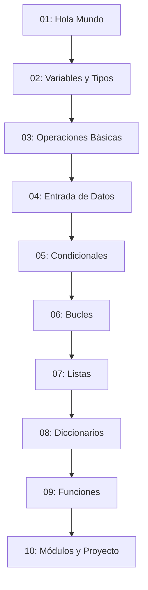

# 📊 Índice de Ejemplos - Progresión Incremental

## 🗺️ Mapa de Ruta de Aprendizaje

```
🌱 BÁSICO → 🌿 PRINCIPIANTE-INTERMEDIO → 🌳 INTERMEDIO → 🌲 AVANZADO
   ↓                    ↓                      ↓            ↓
📁 01-03              📁 04-06               📁 07-08      📁 09-10
```

## 📚 Lista de Archivos por Orden de Estudio

### 🎯 Orden Recomendado de Ejecución

1. **`ejemplo_01_hola_mundo.py`** ➜ Tu primer programa
2. **`ejemplo_02_variables_tipos.py`** ➜ Datos y variables  
3. **`ejemplo_03_operaciones_basicas.py`** ➜ Cálculos y operadores
4. **`ejemplo_04_entrada_datos.py`** ➜ Interacción con usuarios
5. **`ejemplo_05_condicionales.py`** ➜ Decisiones lógicas
6. **`ejemplo_06_bucles.py`** ➜ Repetición automática
7. **`ejemplo_07_listas.py`** ➜ Colecciones de datos
8. **`ejemplo_08_diccionarios.py`** ➜ Datos estructurados
9. **`ejemplo_09_funciones.py`** ➜ Código modular
10. **`ejemplo_10_modulos_proyecto.py`** ➜ Proyecto completo

## 🔗 Dependencias entre Ejemplos



## ⚡ Ejecución Rápida

Para ejecutar todos los ejemplos en secuencia:

```bash
# Ejecutar ejemplo por ejemplo
python ejemplo_01_hola_mundo.py
python ejemplo_02_variables_tipos.py
python ejemplo_03_operaciones_basicas.py
python ejemplo_04_entrada_datos.py
python ejemplo_05_condicionales.py
python ejemplo_06_bucles.py
python ejemplo_07_listas.py
python ejemplo_08_diccionarios.py
python ejemplo_09_funciones.py
python ejemplo_10_modulos_proyecto.py
```

## 📈 Progresión de Complejidad

| Ejemplo | Líneas de Código | Conceptos Nuevos | Dificultad |
|---------|------------------|------------------|------------|
| 01 | ~20 | 2 | ⭐ |
| 02 | ~35 | 3 | ⭐ |
| 03 | ~45 | 4 | ⭐⭐ |
| 04 | ~50 | 3 | ⭐⭐ |
| 05 | ~70 | 5 | ⭐⭐⭐ |
| 06 | ~95 | 4 | ⭐⭐⭐ |
| 07 | ~120 | 6 | ⭐⭐⭐⭐ |
| 08 | ~150 | 5 | ⭐⭐⭐⭐ |
| 09 | ~200 | 7 | ⭐⭐⭐⭐⭐ |
| 10 | ~320 | 8 | ⭐⭐⭐⭐⭐ |

## 🎯 Puntos de Control (Checkpoints)

### ✅ Checkpoint 1 (Ejemplos 1-3): "Fundamentos Básicos"
**Deberías poder:**
- Crear variables de diferentes tipos
- Realizar operaciones matemáticas
- Usar print() para mostrar resultados

### ✅ Checkpoint 2 (Ejemplos 4-6): "Programas Interactivos"
**Deberías poder:**
- Obtener datos del usuario con input()
- Crear lógica condicional
- Usar bucles para repetir acciones

### ✅ Checkpoint 3 (Ejemplos 7-8): "Manejo de Datos"
**Deberías poder:**
- Trabajar con listas y diccionarios
- Organizar datos estructurados
- Crear programas con múltiples opciones

### ✅ Checkpoint 4 (Ejemplos 9-10): "Programación Avanzada"
**Deberías poder:**
- Crear y usar funciones
- Organizar código en módulos
- Desarrollar aplicaciones completas

## 🚀 Proyectos Graduales Construidos

1. **Calculadora de IMC** (Ejemplo 4)
2. **Sistema de Calificaciones** (Ejemplo 5)  
3. **Analizador de Texto** (Ejemplo 6)
4. **Gestor de Tareas** (Ejemplo 7)
5. **Sistema de Inventario** (Ejemplo 8)
6. **Calculadora Científica** (Ejemplo 9)
7. **Agenda Personal Completa** (Ejemplo 10)

---

**🎓 Al completar todos los ejemplos, estarás listo para la Fase 01: Fundamentos de IA**