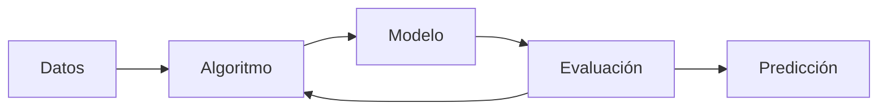

# 🧠 Introducción al Machine Learning

## 📋 Información de la Unidad

- **Fase**: 01 - Fundamentos de IA
- **Unidad**: 05 - Introducción al Machine Learning
- **Duración estimada**: 5-6 horas
- **Modalidad**: Teórico-práctica con código

## 🎯 Objetivos de Aprendizaje

Al completar esta unidad, podrás:

✅ **Definir** Machine Learning y sus diferencias con IA tradicional  
✅ **Clasificar** los tipos principales de ML (supervisado, no supervisado, refuerzo)  
✅ **Comprender** el proceso completo de desarrollo de modelos ML  
✅ **Identificar** algoritmos apropiados para diferentes tipos de problemas  
✅ **Implementar** ejemplos básicos con Python y scikit-learn  

---

## 🎨 ¿Qué es Machine Learning?

### 📖 **Definición Formal**

> **Machine Learning** es un subcampo de la Inteligencia Artificial que permite a las computadoras aprender y mejorar automáticamente a partir de la experiencia sin ser explícitamente programadas para cada tarea específica.

### 🔄 **ML vs Programación Tradicional**

#### **Programación Tradicional**
```
Datos + Programa → Salida
```

**Ejemplo**: Sistema de nómina
```python
def calcular_salario(horas_trabajadas, tarifa_hora):
    if horas_trabajadas <= 40:
        return horas_trabajadas * tarifa_hora
    else:
        extra = horas_trabajadas - 40
        return (40 * tarifa_hora) + (extra * tarifa_hora * 1.5)
```

#### **Machine Learning**
```
Datos + Salidas Deseadas → Modelo (Programa)
```

**Ejemplo**: Sistema de detección de spam
```python
# En lugar de escribir reglas explícitas:
# if "OFERTA" in email and "URGENTE" in email:
#     return "spam"

# ML aprende patrones automáticamente:
model = train_model(emails_examples, labels)
prediction = model.predict(new_email)
```

### 🧩 **Componentes Clave del ML**

1. **Datos**: La materia prima del aprendizaje
2. **Algoritmo**: El método de aprendizaje
3. **Modelo**: El resultado del entrenamiento
4. **Evaluación**: Medición del rendimiento
5. **Predicción**: Aplicación a nuevos datos



---

## 📊 Tipos de Machine Learning

### 🎯 **1. Aprendizaje Supervisado (Supervised Learning)**

#### **Definición**
El algoritmo aprende a partir de ejemplos etiquetados, donde conocemos tanto las entradas como las salidas correctas.

#### **Estructura de Datos**
```python
# Ejemplo de dataset supervisado
X = [[1.2, 3.4], [2.1, 1.8], [3.2, 4.1]]  # Features (entradas)
y = ['A', 'B', 'A']                        # Labels (salidas)
```

#### **Tipos Principales**

##### **Clasificación**
- **Objetivo**: Predecir categorías o clases
- **Salida**: Discreta (etiquetas)
- **Ejemplos**: Spam/No spam, Gato/Perro, Diagnóstico médico

**Ejemplo Práctico**: Clasificación de emails
```python
from sklearn.feature_extraction.text import TfidfVectorizer
from sklearn.naive_bayes import MultinomialNB
from sklearn.pipeline import Pipeline

# Datos de ejemplo
emails = [
    "Oferta especial! Compra ahora!",
    "Reunión mañana a las 10 AM",
    "¡¡¡FELICIDADES HAS GANADO!!!",
    "Informe mensual adjunto"
]
labels = ['spam', 'ham', 'spam', 'ham']

# Crear y entrenar modelo
model = Pipeline([
    ('tfidf', TfidfVectorizer()),
    ('classifier', MultinomialNB())
])

model.fit(emails, labels)

# Predecir nuevo email
nuevo_email = ["Promoción limitada, actúa ya!"]
prediccion = model.predict(nuevo_email)
print(f"Clasificación: {prediccion[0]}")  # Resultado: spam
```

##### **Regresión**
- **Objetivo**: Predecir valores continuos
- **Salida**: Numérica
- **Ejemplos**: Precio de casa, temperatura, ventas

**Ejemplo Práctico**: Predicción de precios de casas
```python
from sklearn.linear_model import LinearRegression
import numpy as np

# Datos: [metros cuadrados, número de habitaciones, edad]
X = np.array([
    [100, 3, 5],   # Casa 1
    [150, 4, 2],   # Casa 2
    [80, 2, 10],   # Casa 3
    [200, 5, 1]    # Casa 4
])

# Precios en miles de euros
y = np.array([200, 350, 150, 500])

# Entrenar modelo
modelo = LinearRegression()
modelo.fit(X, y)

# Predecir precio de nueva casa: 120m², 3 habitaciones, 3 años
nueva_casa = [[120, 3, 3]]
precio_predicho = modelo.predict(nueva_casa)
print(f"Precio estimado: {precio_predicho[0]:.0f}k €")
```

#### **Algoritmos Populares**

| Algoritmo | Mejor Para | Ventajas | Desventajas |
|-----------|------------|----------|-------------|
| **Linear Regression** | Regresión simple | Interpretable, rápido | Solo relaciones lineales |
| **Decision Trees** | Clasificación/Regresión | Interpretable | Overfitting |
| **Random Forest** | Clasificación/Regresión | Robusto, buen rendimiento | Menos interpretable |
| **SVM** | Clasificación compleja | Efectivo en alta dimensión | Lento con datasets grandes |
| **Neural Networks** | Problemas complejos | Muy flexible | Caja negra, muchos datos |

### 🔍 **2. Aprendizaje No Supervisado (Unsupervised Learning)**

#### **Definición**
El algoritmo encuentra patrones ocultos en datos sin etiquetas, explorando la estructura subyacente.

#### **Estructura de Datos**
```python
# Ejemplo de dataset no supervisado
X = [[1.2, 3.4], [2.1, 1.8], [3.2, 4.1]]  # Solo features, sin labels
# El algoritmo debe encontrar patrones por sí mismo
```

#### **Tipos Principales**

##### **Clustering (Agrupamiento)**
- **Objetivo**: Encontrar grupos naturales en los datos
- **Aplicaciones**: Segmentación de clientes, análisis de genes

**Ejemplo Práctico**: Segmentación de clientes
```python
from sklearn.cluster import KMeans
import matplotlib.pyplot as plt
import numpy as np

# Datos de clientes: [edad, ingresos anuales en k€]
clientes = np.array([
    [25, 15], [27, 20], [35, 35], [45, 60],
    [50, 65], [23, 18], [30, 30], [40, 50],
    [55, 70], [28, 25], [38, 40], [48, 58]
])

# Aplicar K-Means con 3 grupos
kmeans = KMeans(n_clusters=3, random_state=42)
grupos = kmeans.fit_predict(clientes)

# Visualizar resultados
plt.scatter(clientes[:, 0], clientes[:, 1], c=grupos, cmap='viridis')
plt.xlabel('Edad')
plt.ylabel('Ingresos (k€)')
plt.title('Segmentación de Clientes')
plt.show()

# Interpretar grupos
print("Centroides de los grupos:")
for i, centroide in enumerate(kmeans.cluster_centers_):
    print(f"Grupo {i}: Edad={centroide[0]:.1f}, Ingresos={centroide[1]:.1f}k€")
```

##### **Reducción de Dimensionalidad**
- **Objetivo**: Simplificar datos manteniendo información importante
- **Aplicaciones**: Visualización, compresión, preprocessing

**Ejemplo Práctico**: PCA para visualización
```python
from sklearn.decomposition import PCA
from sklearn.datasets import load_iris
import matplotlib.pyplot as plt

# Cargar dataset Iris (4 dimensiones)
datos = load_iris()
X, y = datos.data, datos.target

# Reducir de 4D a 2D
pca = PCA(n_components=2)
X_reducido = pca.fit_transform(X)

# Visualizar
plt.figure(figsize=(8, 6))
scatter = plt.scatter(X_reducido[:, 0], X_reducido[:, 1], c=y, cmap='viridis')
plt.xlabel(f'PC1 ({pca.explained_variance_ratio_[0]:.1%} varianza)')
plt.ylabel(f'PC2 ({pca.explained_variance_ratio_[1]:.1%} varianza)')
plt.title('Dataset Iris - Proyección PCA')
plt.colorbar(scatter)
plt.show()
```

##### **Detección de Anomalías**
- **Objetivo**: Identificar datos atípicos o inusuales
- **Aplicaciones**: Detección de fraude, mantenimiento predictivo

**Ejemplo Práctico**: Detección de transacciones fraudulentas
```python
from sklearn.ensemble import IsolationForest
import numpy as np

# Datos de transacciones: [monto, hora del día]
transacciones = np.array([
    [50, 14], [25, 12], [100, 18], [75, 16],    # Normales
    [30, 10], [45, 15], [80, 19], [35, 13],    # Normales
    [1000, 3], [2000, 4]                       # Posibles fraudes
])

# Entrenar detector de anomalías
detector = IsolationForest(contamination=0.2, random_state=42)
anomalias = detector.fit_predict(transacciones)

# Identificar transacciones sospechosas
for i, (transaccion, es_anomalia) in enumerate(zip(transacciones, anomalias)):
    estado = "FRAUDE" if es_anomalia == -1 else "Normal"
    print(f"Transacción {i}: ${transaccion[0]} a las {transaccion[1]}h -> {estado}")
```

### 🎮 **3. Aprendizaje por Refuerzo (Reinforcement Learning)**

#### **Definición**
El algoritmo aprende a través de interacciones con un entorno, recibiendo recompensas o penalizaciones por sus acciones.

#### **Componentes Clave**
- **Agente**: El que toma decisiones
- **Entorno**: El mundo donde actúa el agente
- **Estado**: Situación actual
- **Acción**: Lo que puede hacer el agente
- **Recompensa**: Feedback del entorno

#### **Ejemplo Conceptual**: Enseñar a jugar
```python
# Pseudocódigo de Q-Learning simple
class QLearningAgent:
    def __init__(self):
        self.q_table = {}  # Estado-acción -> valor
        self.learning_rate = 0.1
        self.discount_factor = 0.9
        self.epsilon = 0.1  # Exploración vs explotación
    
    def choose_action(self, state):
        if random.random() < self.epsilon:
            return random.choice(possible_actions)  # Explorar
        else:
            return best_action_from_q_table(state)  # Explotar
    
    def update_q_value(self, state, action, reward, next_state):
        old_value = self.q_table.get((state, action), 0)
        next_max = max(self.q_table.get((next_state, a), 0) 
                      for a in possible_actions)
        
        new_value = old_value + self.learning_rate * (
            reward + self.discount_factor * next_max - old_value
        )
        self.q_table[(state, action)] = new_value
```

#### **Aplicaciones Famosas**
- **AlphaGo**: Dominio del juego de Go
- **OpenAI Five**: Dota 2 profesional
- **ChatGPT**: RLHF (Reinforcement Learning from Human Feedback)

---

## 🔄 El Proceso de Machine Learning

### 📋 **Metodología Estándar**

#### **1. Definición del Problema**
- **¿Qué queremos predecir?**
- **¿Qué tipo de problema es?** (clasificación, regresión, clustering)
- **¿Qué datos necesitamos?**

#### **2. Recolección y Preparación de Datos**

##### **Exploración de Datos (EDA)**
```python
import pandas as pd
import matplotlib.pyplot as plt
import seaborn as sns

# Cargar datos
df = pd.read_csv('datos.csv')

# Exploración básica
print("Información del dataset:")
print(df.info())
print("\nEstadísticas descriptivas:")
print(df.describe())

# Visualizaciones
fig, axes = plt.subplots(2, 2, figsize=(12, 10))

# Distribuciones
df.hist(bins=20, ax=axes[0, 0])
axes[0, 0].set_title('Distribuciones')

# Correlaciones
sns.heatmap(df.corr(), annot=True, ax=axes[0, 1])
axes[0, 1].set_title('Matriz de Correlación')

# Valores faltantes
missing_data = df.isnull().sum()
missing_data[missing_data > 0].plot(kind='bar', ax=axes[1, 0])
axes[1, 0].set_title('Valores Faltantes')

plt.tight_layout()
plt.show()
```

##### **Limpieza de Datos**
```python
from sklearn.impute import SimpleImputer
from sklearn.preprocessing import StandardScaler, LabelEncoder

# Manejar valores faltantes
imputer = SimpleImputer(strategy='mean')
df_numeric = imputer.fit_transform(df.select_dtypes(include=[np.number]))

# Codificar variables categóricas
le = LabelEncoder()
df['categoria_encoded'] = le.fit_transform(df['categoria'])

# Normalizar features numéricas
scaler = StandardScaler()
X_scaled = scaler.fit_transform(X)
```

#### **3. División de Datos**
```python
from sklearn.model_selection import train_test_split

# División estándar: 70% entrenamiento, 15% validación, 15% test
X_temp, X_test, y_temp, y_test = train_test_split(
    X, y, test_size=0.15, random_state=42, stratify=y
)

X_train, X_val, y_train, y_val = train_test_split(
    X_temp, y_temp, test_size=0.176, random_state=42, stratify=y_temp
)  # 0.176 ≈ 0.15/0.85 para obtener 15% del total

print(f"Entrenamiento: {len(X_train)} muestras")
print(f"Validación: {len(X_val)} muestras") 
print(f"Test: {len(X_test)} muestras")
```

#### **4. Selección y Entrenamiento del Modelo**

##### **Comparación de Algoritmos**
```python
from sklearn.ensemble import RandomForestClassifier
from sklearn.svm import SVC
from sklearn.linear_model import LogisticRegression
from sklearn.metrics import accuracy_score, classification_report

# Definir modelos a comparar
modelos = {
    'Random Forest': RandomForestClassifier(n_estimators=100, random_state=42),
    'SVM': SVC(kernel='rbf', random_state=42),
    'Logistic Regression': LogisticRegression(random_state=42)
}

# Entrenar y evaluar cada modelo
resultados = {}
for nombre, modelo in modelos.items():
    # Entrenar
    modelo.fit(X_train, y_train)
    
    # Predecir en validación
    y_pred = modelo.predict(X_val)
    
    # Evaluar
    accuracy = accuracy_score(y_val, y_pred)
    resultados[nombre] = accuracy
    
    print(f"{nombre}: {accuracy:.3f}")

# Seleccionar mejor modelo
mejor_modelo = max(resultados, key=resultados.get)
print(f"\nMejor modelo: {mejor_modelo}")
```

#### **5. Optimización de Hiperparámetros**
```python
from sklearn.model_selection import GridSearchCV

# Definir espacio de búsqueda
param_grid = {
    'n_estimators': [50, 100, 200],
    'max_depth': [None, 10, 20, 30],
    'min_samples_split': [2, 5, 10]
}

# Búsqueda con validación cruzada
grid_search = GridSearchCV(
    RandomForestClassifier(random_state=42),
    param_grid,
    cv=5,
    scoring='accuracy',
    n_jobs=-1
)

grid_search.fit(X_train, y_train)

print("Mejores parámetros:", grid_search.best_params_)
print("Mejor score CV:", grid_search.best_score_)

# Usar mejor modelo
mejor_modelo_optimizado = grid_search.best_estimator_
```

#### **6. Evaluación Final**
```python
from sklearn.metrics import confusion_matrix, classification_report
import seaborn as sns

# Predicciones en conjunto de test
y_pred_test = mejor_modelo_optimizado.predict(X_test)

# Métricas de evaluación
accuracy = accuracy_score(y_test, y_pred_test)
report = classification_report(y_test, y_pred_test)

print(f"Accuracy en test: {accuracy:.3f}")
print("\nReporte detallado:")
print(report)

# Matriz de confusión
cm = confusion_matrix(y_test, y_pred_test)
plt.figure(figsize=(8, 6))
sns.heatmap(cm, annot=True, fmt='d', cmap='Blues')
plt.title('Matriz de Confusión')
plt.ylabel('Verdadero')
plt.xlabel('Predicho')
plt.show()
```

---

## 📊 Métricas de Evaluación

### 🎯 **Para Clasificación**

#### **Matriz de Confusión**
```
                Predicho
               Pos  Neg
Verdadero Pos  TP   FN
          Neg  FP   TN
```

#### **Métricas Derivadas**

1. **Accuracy (Exactitud)**
   ```
   Accuracy = (TP + TN) / (TP + TN + FP + FN)
   ```

2. **Precision (Precisión)**
   ```
   Precision = TP / (TP + FP)
   ```
   *"De los que predije como positivos, ¿cuántos realmente lo eran?"*

3. **Recall (Sensibilidad)**
   ```
   Recall = TP / (TP + FN)
   ```
   *"De todos los positivos reales, ¿cuántos logré identificar?"*

4. **F1-Score**
   ```
   F1 = 2 × (Precision × Recall) / (Precision + Recall)
   ```
   *Media armónica entre precisión y recall*

#### **Ejemplo de Interpretación**

**Caso**: Detección de cáncer
- **Alta Precision**: Pocos falsos positivos (no asustar innecesariamente)
- **Alto Recall**: Pocos falsos negativos (no perder casos de cáncer)
- **Trade-off**: Generalmente uno afecta al otro

### 📈 **Para Regresión**

1. **Mean Absolute Error (MAE)**
   ```python
   MAE = Σ|y_true - y_pred| / n
   ```

2. **Mean Squared Error (MSE)**
   ```python
   MSE = Σ(y_true - y_pred)² / n
   ```

3. **Root Mean Squared Error (RMSE)**
   ```python
   RMSE = √MSE
   ```

4. **R² Score (Coeficiente de Determinación)**
   ```python
   R² = 1 - (SS_res / SS_tot)
   ```

```python
from sklearn.metrics import mean_absolute_error, mean_squared_error, r2_score
import numpy as np

# Predicciones del modelo de precios de casas
y_true = [200, 350, 150, 500]
y_pred = [180, 380, 140, 480]

# Calcular métricas
mae = mean_absolute_error(y_true, y_pred)
mse = mean_squared_error(y_true, y_pred)
rmse = np.sqrt(mse)
r2 = r2_score(y_true, y_pred)

print(f"MAE: {mae:.2f}k €")
print(f"MSE: {mse:.2f}")
print(f"RMSE: {rmse:.2f}k €")
print(f"R²: {r2:.3f}")
```

---

## ⚠️ Problemas Comunes y Soluciones

### 🎯 **Overfitting (Sobreajuste)**

#### **¿Qué es?**
El modelo memoriza los datos de entrenamiento pero no generaliza bien a datos nuevos.

#### **Síntomas**
- Alta accuracy en entrenamiento, baja en validación
- Gran diferencia entre train y validation loss

#### **Soluciones**
```python
# 1. Más datos
# 2. Regularización
from sklearn.linear_model import Ridge, Lasso

ridge = Ridge(alpha=1.0)  # L2 regularization
lasso = Lasso(alpha=1.0)  # L1 regularization

# 3. Cross-validation
from sklearn.model_selection import cross_val_score

scores = cross_val_score(modelo, X, y, cv=5)
print(f"CV Score: {scores.mean():.3f} (+/- {scores.std() * 2:.3f})")

# 4. Early stopping (para neural networks)
# 5. Dropout (para neural networks)
```

### 🎯 **Underfitting (Subajuste)**

#### **¿Qué es?**
El modelo es demasiado simple para capturar los patrones en los datos.

#### **Síntomas**
- Baja accuracy tanto en entrenamiento como en validación
- El modelo no mejora con más datos

#### **Soluciones**
- Modelos más complejos
- Más features
- Reducir regularización
- Ingeniería de features

### 🎯 **Data Leakage**

#### **¿Qué es?**
Información del futuro o del target "se filtra" en las features.

#### **Ejemplo Problemático**
```python
# MALO: Usar información que no estaría disponible en producción
# Predecir si un paciente tendrá diabetes usando su medicación actual
features = ['edad', 'peso', 'medicacion_diabetes']  # ¡PROBLEMA!
```

#### **Solución**
```python
# BUENO: Solo usar información disponible antes de la predicción
features = ['edad', 'peso', 'historial_familiar', 'nivel_glucosa']
```

---

## 🧪 Proyecto Práctico: Clasificador de Sentimientos

### 🎯 **Objetivo**
Crear un clasificador que determine si una reseña de película es positiva o negativa.

### 📝 **Implementación Completa**

```python
import pandas as pd
import numpy as np
from sklearn.model_selection import train_test_split
from sklearn.feature_extraction.text import TfidfVectorizer
from sklearn.linear_model import LogisticRegression
from sklearn.ensemble import RandomForestClassifier
from sklearn.metrics import accuracy_score, classification_report, confusion_matrix
import matplotlib.pyplot as plt
import seaborn as sns

# 1. Datos de ejemplo (en la práctica, cargarías desde archivo)
reviews = [
    ("Esta película es fantástica, me encantó", "positivo"),
    ("Terrible filme, aburrido y mal actuado", "negativo"),
    ("Excelente actuación y gran historia", "positivo"),
    ("No me gustó nada, muy confusa", "negativo"),
    ("Una obra maestra del cine", "positivo"),
    ("Perdí mi tiempo viendo esto", "negativo"),
    ("Increíble cinematografía y soundtrack", "positivo"),
    ("Decepcionante, esperaba más", "negativo"),
    ("Brillante dirección y guión", "positivo"),
    ("Muy predecible y cliché", "negativo")
]

# Separar textos y etiquetas
textos = [review[0] for review in reviews]
etiquetas = [review[1] for review in reviews]

# 2. Preparación de datos
vectorizer = TfidfVectorizer(max_features=1000, stop_words='english')
X = vectorizer.fit_transform(textos)
y = np.array(etiquetas)

# División train/test
X_train, X_test, y_train, y_test = train_test_split(
    X, y, test_size=0.3, random_state=42, stratify=y
)

# 3. Entrenamiento de modelos
modelos = {
    'Logistic Regression': LogisticRegression(random_state=42),
    'Random Forest': RandomForestClassifier(n_estimators=100, random_state=42)
}

resultados = {}
for nombre, modelo in modelos.items():
    # Entrenar
    modelo.fit(X_train, y_train)
    
    # Predecir
    y_pred = modelo.predict(X_test)
    
    # Evaluar
    accuracy = accuracy_score(y_test, y_pred)
    resultados[nombre] = {
        'modelo': modelo,
        'accuracy': accuracy,
        'predictions': y_pred
    }
    
    print(f"{nombre}: {accuracy:.3f}")

# 4. Seleccionar mejor modelo
mejor_nombre = max(resultados, key=lambda x: resultados[x]['accuracy'])
mejor_modelo = resultados[mejor_nombre]['modelo']

print(f"\nMejor modelo: {mejor_nombre}")

# 5. Función de predicción
def predecir_sentimiento(texto):
    texto_vectorizado = vectorizer.transform([texto])
    prediccion = mejor_modelo.predict(texto_vectorizado)[0]
    probabilidades = mejor_modelo.predict_proba(texto_vectorizado)[0]
    
    return {
        'sentimiento': prediccion,
        'confianza': max(probabilidades)
    }

# 6. Probar con nuevos textos
nuevas_reviews = [
    "Me encantó esta película, súper recomendada",
    "Qué aburrimiento, no la terminaría de ver",
    "Interesante propuesta pero mal ejecutada"
]

print("\nPredicciones en nuevas reviews:")
for review in nuevas_reviews:
    resultado = predecir_sentimiento(review)
    print(f"'{review}' -> {resultado['sentimiento']} (confianza: {resultado['confianza']:.2f})")
```

### 📊 **Análisis de Resultados**

```python
# Matriz de confusión
cm = confusion_matrix(y_test, resultados[mejor_nombre]['predictions'])
plt.figure(figsize=(8, 6))
sns.heatmap(cm, annot=True, fmt='d', cmap='Blues', 
            xticklabels=['Negativo', 'Positivo'],
            yticklabels=['Negativo', 'Positivo'])
plt.title(f'Matriz de Confusión - {mejor_nombre}')
plt.ylabel('Verdadero')
plt.xlabel('Predicho')
plt.show()

# Palabras más importantes
if hasattr(mejor_modelo, 'feature_importances_'):
    # Para Random Forest
    importances = mejor_modelo.feature_importances_
elif hasattr(mejor_modelo, 'coef_'):
    # Para Logistic Regression
    importances = np.abs(mejor_modelo.coef_[0])

# Obtener nombres de features
feature_names = vectorizer.get_feature_names_out()
top_indices = np.argsort(importances)[-10:]

plt.figure(figsize=(10, 6))
plt.barh(range(len(top_indices)), importances[top_indices])
plt.yticks(range(len(top_indices)), [feature_names[i] for i in top_indices])
plt.title('Top 10 Palabras Más Importantes')
plt.xlabel('Importancia')
plt.show()
```

---

## 🎯 Preguntas de Autoevaluación

### 📝 **Nivel Básico**

1. **¿Cuál es la principal diferencia entre ML y programación tradicional?**
   - [ ] ML es más rápido
   - [ ] ML aprende patrones automáticamente ✅
   - [ ] ML no necesita datos
   - [ ] ML es siempre más preciso

2. **¿Qué tipo de ML usa datos etiquetados?**
   - [ ] No supervisado
   - [ ] Supervisado ✅
   - [ ] Por refuerzo
   - [ ] Todos los tipos

3. **¿Qué métrica es mejor para evaluar un clasificador balanceado?**
   - [ ] Solo Precision
   - [ ] Solo Recall
   - [ ] F1-Score ✅
   - [ ] Solo Accuracy

### 📝 **Nivel Intermedio**

4. **Explica la diferencia entre overfitting y underfitting. Da un ejemplo de cada uno.**

5. **¿Cuándo usarías clustering vs clasificación? Proporciona ejemplos específicos.**

6. **Describe el proceso completo de desarrollo de un modelo de ML, desde el problema hasta la producción.**

### 📝 **Nivel Avanzado**

7. **Diseña un sistema de recomendación para una plataforma de streaming:**
   - ¿Qué tipo de ML usarías?
   - ¿Qué datos necesitarías?
   - ¿Cómo evaluarías el rendimiento?
   - ¿Qué desafíos anticipas?

8. **Analiza este escenario: Tienes un dataset de 1000 muestras, 50 features, y el 95% de las muestras son de la clase A y 5% de la clase B. ¿Qué problemas identificas y cómo los resolverías?**

---

## 📖 Recursos Adicionales

### 📚 **Libros Recomendados**
- **"Hands-On Machine Learning"** - Aurélien Géron
- **"The Elements of Statistical Learning"** - Hastie, Tibshirani, Friedman
- **"Pattern Recognition and Machine Learning"** - Christopher Bishop

### 🌐 **Cursos Online**
- [**Andrew Ng's Machine Learning Course**](https://www.coursera.org/learn/machine-learning) - Coursera
- [**Fast.ai Practical Deep Learning**](https://fast.ai/)
- [**MIT 6.034 Artificial Intelligence**](https://ocw.mit.edu/courses/electrical-engineering-and-computer-science/6-034-artificial-intelligence-fall-2010/)

### 🛠️ **Herramientas y Librerías**
- **Scikit-learn**: ML general purpose
- **TensorFlow/Keras**: Deep Learning
- **PyTorch**: Deep Learning (investigación)
- **XGBoost**: Gradient boosting
- **Pandas**: Manipulación de datos
- **Matplotlib/Seaborn**: Visualización

### 📊 **Datasets para Práctica**
- [**Kaggle Datasets**](https://www.kaggle.com/datasets)
- [**UCI ML Repository**](https://archive.ics.uci.edu/ml/index.php)
- [**Google Dataset Search**](https://datasetsearch.research.google.com/)

---

## ✅ Resumen de la Unidad

### 🎯 **Conceptos Clave Dominados**

1. **Machine Learning**: Aprendizaje automático a partir de datos
2. **Tipos de ML**: Supervisado, no supervisado, por refuerzo
3. **Proceso completo**: Desde problema hasta evaluación
4. **Algoritmos principales**: Clasificación, regresión, clustering
5. **Evaluación**: Métricas apropiadas para cada tipo de problema

### 🔍 **Habilidades Desarrolladas**

1. **Identificar** tipo de problema ML apropiado
2. **Preparar** datos para entrenamiento
3. **Implementar** modelos básicos con scikit-learn
4. **Evaluar** rendimiento con métricas apropiadas
5. **Detectar** y solucionar problemas comunes

### 🚀 **Preparación para Próximas Fases**

Has completado los **fundamentos de IA y ML**. En las siguientes fases del curso exploraremos:

**Phase 2**: **Deep Learning y Redes Neuronales**
- Arquitecturas de redes neuronales
- CNNs para visión por computadora
- RNNs para secuencias temporales
- Transformers y LLMs

**Phase 3**: **IA Generativa y Automatización**
- Modelos generativos (GANs, VAEs, Diffusion)
- Aplicaciones de ChatGPT y LLMs
- Automatización de procesos con IA
- Integración en flujos de trabajo

---

**¡Felicidades! 🎉 Has completado la Phase 1 del curso y tienes una base sólida en IA y Machine Learning. Ahora estás listo para profundizar en técnicas más avanzadas.**